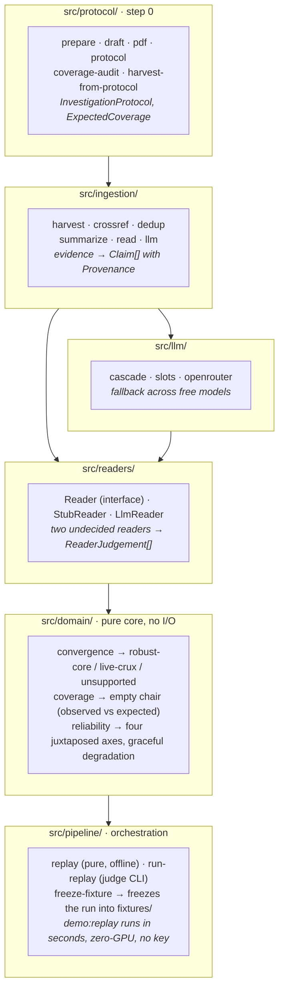
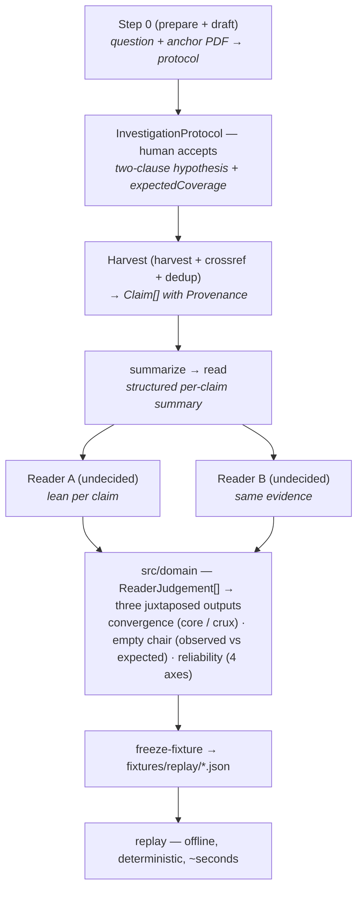
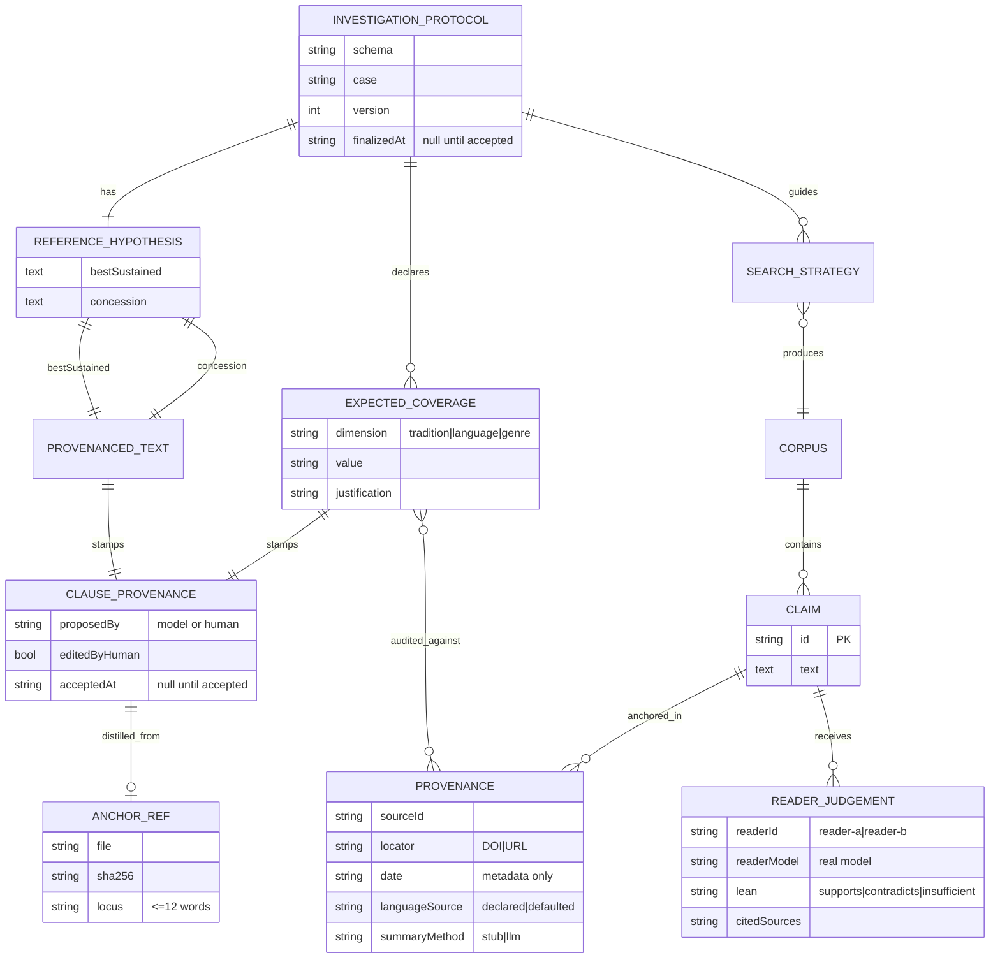

# TACET — Architecture

A small, self-contained pipeline. Each stage is a pure domain operation; the
network sits only at the edges (harvest, summarize, read, the step-0 draft). The
names below mirror the production version, so this prototype is its executable
spec.

These three diagrams are faithful to the source tree as it stands: the layers
are the real directories under `src/`, the arrows follow the actual import
graph, and the data model is the real shape of the two `types.ts` files.

## 1. Architecture — layers and dependencies

Read top to bottom: it is also the dependency order. `src/domain/` imports
nothing from outside itself; everything flows down into it, and `src/pipeline/`
orchestrates the offline replay.

### Why two undecided readers (not two advocates)

If each reader argued an assigned side, their disagreement would be guaranteed
by construction and discover nothing. Two readers that both start undecided,
over the same evidence, disagree only where the evidence is genuinely ambiguous,
so a split locates a real crux and convergence-despite-doubt is a robustness
signal that construction did not plant. This is the answer to the circularity
objection ("each reader just confirms its own corpus"): there is no per-side
corpus to confirm.

## 2. Pipeline — from step 0 to replay

The flow end to end. Step 0 produces a protocol the human accepts; the harvest
builds the corpus; `summarize` and `read` prepare the claims; two undecided
readers produce leans over the same evidence; the pure domain computes the three
juxtaposed outputs; `freeze` pins the run into a fixture; and `replay`
reproduces it offline.

### Modes

- **replay** (judge default): runs over `fixtures/`, deterministic, zero-GPU, no
  model call. `npm run demo:replay`. The replay itself runs in seconds; on a
  clean machine the only real wait is dependency installation.
- **live**: `LlmReader` calls a real model behind the `Reader` interface; the
  step-0 draft and the harvest/summarize/read stages call free models.

## 3. Data model — the provenance trail made structural

The shape of the two `types.ts` files. The point the diagram makes visible is
the provenance trail: every `ProvenancedText` and every `ExpectedCoverageEntry`
stamps a `ClauseProvenance` recording who proposed it (a model or the human),
whether a human edited it, and when it was accepted. "Model proposes, human
disposes" is cardinality, not prose. And `ReaderJudgement` carries the real
`readerModel`, not just the slot, so a disagreement is always auditable back to
which model produced each lean.

> Time is metadata, never a decision rule. `Provenance.date` informs the
> reliability profile and an optional temporal layer over the map; it never
> makes a reader conclude "newer wins."

## 4. Stack, commands & configuration

Reference material extracted from the source, not from memory. For the *why* —
the locked decisions, epistemic constraints, and conventions — see
[`CLAUDE.md`](../CLAUDE.md); not repeated here.

### Stack

| Layer | Technology | Version |
|-------|-----------|---------|
| Language | TypeScript (strict total: `noUncheckedIndexedAccess`, `exactOptionalPropertyTypes`) | ^5.6 |
| Runtime | Node.js, ESM (`type: module`) | ≥18 (≥22.15 for live — see Commands) |
| Tests | Vitest | ^2.1 |
| TS runner (dev/live) | tsx (`--import tsx`) | ^4.19 |
| PDF parsing (step 0) | unpdf | ^1.6 |
| Model backend (live) | OpenRouter free tier (OpenAI-compatible) | — |

Pure domain core: **no framework, no database, no HTTP server**. The network
lives only in `src/ingestion/` (harvest, summarize, read) and
`src/llm/openrouter.ts`; everything in `src/domain/` and `src/pipeline/replay.ts`
is offline and deterministic. (No `API_ENDPOINTS.md` / `DATABASE_SCHEMA.md` —
there are no HTTP routes and no database to document.)

### Commands

| Script | Does | Network |
|--------|------|---------|
| `npm test` | Vitest suite (transport stubs — never hits a model) | no |
| `npm run typecheck` / `npm run build` | `tsc --noEmit` / emit to `dist/` | no |
| `npm run demo:replay` | build + replay the frozen fixture — **the judge's path** | no |
| `npm run harvest -- <case>` | Crossref → `corpus/<case>.json` | yes |
| `npm run summarize -- <corpus>.json` | LLM structured summaries (cascade over free models) | yes |
| `npm run read -- <corpus>.summarized.json` | two undecided readers → leans (`DistinctReaders`) | yes |
| `npm run freeze -- <corpus>.summarized.read.json [version]` | pin a run into `fixtures/replay/sago-origin-v<version>.json` | no |
| `npm run llm:check` | ping every live endpoint (key/base/model sanity) | yes |

The live (network) scripts run `node --use-system-ca --import tsx …`:
`--use-system-ca` trusts the OS cert store so TLS works behind a corporate/MITM
proxy (requires **node ≥22.15**); `--import tsx` runs the TypeScript source
directly (no build step, no `dist/` staleness). Replay/build/test need none of
this and stay node-18-compatible.

### Configuration

All live config is environment-only (see [`.env.example`](../.env.example));
`replay` mode needs **none** of it. Keys are never committed.

| Variable | Purpose |
|----------|---------|
| `OPENROUTER_API_KEY` | the single free-tier key — summarizer, both readers, and the reserve pool all fall back to it |
| `SUMMARY_BASE` / `SUMMARY_MODEL` | summarizer endpoint / model (default `openai/gpt-oss-20b:free` on OpenRouter) |
| `READER_A_MODEL` / `READER_B_MODEL` / `READER_FALLBACK_MODEL` | pick slots A, B and reserve C — **must be distinct companies** (validated at runtime); the rest of `FREE_MODELS` (`src/llm/openrouter.ts`) tails the reserve pool |
| `TACET_REFERENCE_HYPOTHESIS` | the shared anchor both readers read against (carried in the corpus, not hardcoded) |
| `TACET_CONTACT_EMAIL` | Crossref polite-pool contact — `harvest` only |

The default reader queue is ranked by `bench/free-model-bench.mjs` over the real
reader prompt; the frozen demo fixture (`sago-origin-v0.2`) was produced by it
(reader A `nvidia/nemotron-3-nano-30b-a3b:free`, reader B
`openai/gpt-oss-120b:free`). `sago-origin-v0.1` is kept as historical
provenance (its leans came from `z-ai/glm-4.6` + `minimax/minimax-m2.7`).
